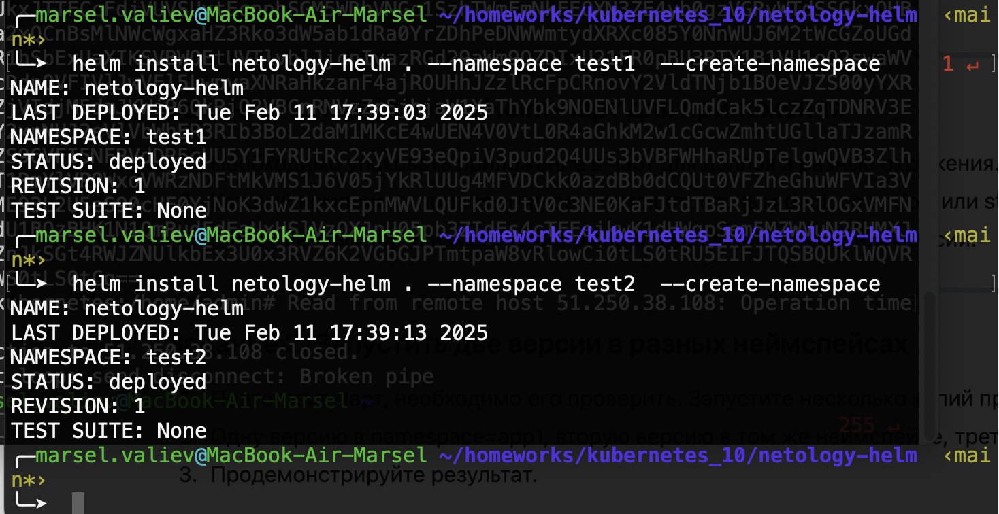
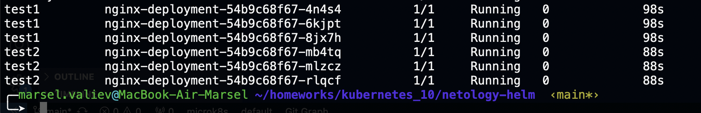

# kubernetes_10
# Домашнее задание к занятию «Helm»

### Задание 1. Подготовить Helm-чарт для приложения

### Ответ 

[Deployment](netology-helm/templates/Deployment.yaml)

### Задание 2. Запустить две версии в разных неймспейсах

### Ответ 

